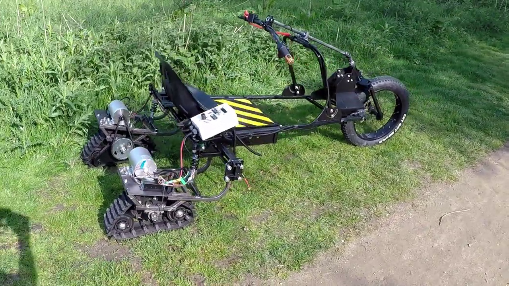
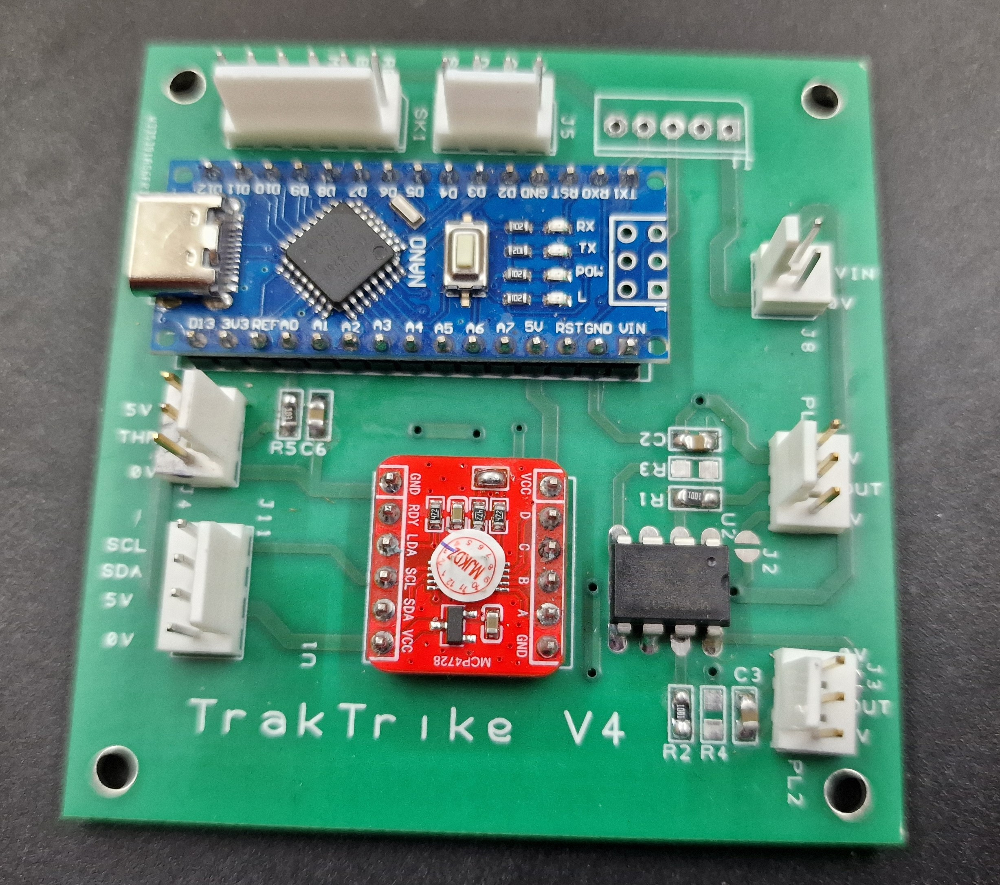

# TrakTrike-Controller

<p align="center">
  
</p>p>  

<p align="center">
  
</p>

Project files at: https://github.com/tonygoacher/TrakTrike-Controller

An Arduino Nano based dual-track vehicle controller designed for tracked electric vehicles,dual motor drive platforms and similar projects that use low cost Aliexpress style BLDC motor controllers.

GCODE files for PCB manufacture and DesignSpark files are included.

The PCB is designed as a drop-in interface between the vehicle controls and a pair of BLDC motor controllers.

  

[I created TrakTrike, a electrically-driven dual-track sit-on trike for EMF camp 2022.](https://hackaday.io/project/205248-electric-tracked-tricycle-for-emf-camp)

  

Initially I used VESC75100 clones for the motor controllers. These gave me a great way of controlling accel/decel profiles on a per motor basis...but, I found them very fragile..having destroyed one pair just by changing some parameters and a second pair at WHY2025 for no reason I ever worked out.

  

At WHY2025 I met some members of [Hacky Racers](https://hackyracers.co.uk/) who suggested trying the inexpensive BLDC controllers available from AliExpress.

  

While these controllers were surprisingly robust and inexpensive, their low-speed throttle behaviour was poor. The vehicle was difficult to manoeuvre accurately OR SAFELY at low throttle positions.

  

TrakTrike-Controller was developed to solve that problem.

The controller transforms the behaviour of inexpensive BLDC controllers by providing configurable throttle shaping, ramp control and speed limiting.
The result is a tracked vehicle that is significantly easier and safer to manoeuvre at low speed.

  

The controller sits above the BLDC motor controllers and is responsible for:

  

- Throttle processing

- Drive profile management

- Track trim compensation

- Throttle Calibration

- Mode handling

- DAC output generation

  

The project uses an MCP4728 quad DAC to generate precise analogue throttle signals for independent left and right motor control.

  
  

---

  

# Features

  

## Drive Profiles

  

The controller supports multiple operating profiles:
| Profile | Purpose |
|--|--|
|Normal  | Full-speed operation |
|Slow   | Manoeuvring mode |
| Reverse  | Reduced-speed reversing |
| Brake  | Rapid deceleration |
| Force | Calibration mode |


Profiles control:

  

- Throttle response curve

- Acceleration rate

- Deceleration rate

- Maximum DAC output

  

---

  

## Throttle Processing

  

Throttle input passes through several stages:

  

1. ADC filtering

2. Deadband removal

3. Soft take-up region

4. Configurable throttle curve

5. Ramp limiting

6. Trim compensation

  

---

  

## Track Trim Compensation

  

The controller uses a trim calibration table containing correction values across the throttle range. During operation, trim values are interpolated and

applied smoothly to compensate for differences between the left and right drive systems as the throttle moves through its full range.

  

---

  

## EEPROM Configuration

  

Configuration is stored in EEPROM and protected by:

  

- Version checking

- CRC validation

  

Stored settings include:

  

- DAC start values

- Maximum DAC values

- Slow mode DAC limits

- Throttle calibration

- Trim calibration table

  

---

  

## Why an MCP4728?

  

Many Arduino vehicle controllers generate throttle voltages using filtered PWM outputs.

  

This project uses an MCP4728 12-bit DAC instead.

  

Benefits include:

  

- True analogue outputs

- Higher resolution

- Repeatable calibration

- Independent left/right outputs

- No PWM ripple

  

---

  

# Hardware

  

## Tested Hardware

  

- Arduino Nano

- MCP4728 Quad DAC

- MCP6002 rail-to-rail op amp (this is used as a voltage follower to 'beef up' the DAC output)

- 16x2 I²C LCD

- Hall-effect twist throttle

- Brake switch

- Reverse switch

- Mode switch

- Dual motor controllers

  

## System Architecture

```

Twist Throttle

	  ↓

TrakTrike-Controller software

      ↓

MCP4728 DAC

      ↓

BLDC Motor Controllers

      ↓

Left / Right Tracks

```

---

  

# Operating Modes

  

## Normal Mode

  

Full-speed operation using the normal drive profile.

  

## Slow Mode

  

Used for precision manoeuvring with reduced maximum speed and gentler acceleration.

  

## Reverse Mode

  

Reverse operation automatically uses the slow profile to improve control and safety.

  

## Brake Mode

  

Highest-priority operating mode.

  

When active:

  

- Brake profile is selected

- Drive output is reset

- Vehicle decelerates rapidly

  

## Force Mode

  

Calibration mode used to apply a fixed throttle value independently of the twist throttle.

  

---

  

# Calibration Procedure

  

Connect the USB serial port of the arduino to a PC and run a monitor program (The one built into the Arduino IDE or PlatformIO is ok)

  

## Throttle Calibration Commands

  

```

cal min (Set the minimum throttle input value)

cal max (Set the maximum throttle input value)

cal apply (Apply the above calibration values with some sanity checks)

```

  

1. Set the physical throttle to its minumum setting

2. Issue the ```cal min ``` command.

3. Set the physical throttle to its maximum position.

4. Issue the ```cal max``` command.

5. Issue the ```cal apply``` command. This will ensure the min is greater than max and save the values to EEPROM.

## Start DAC calibration

  

**ENSURE THE VEHICLE IS LIFTED TO PREVENT MOVEMENT DURING THIS PROCEDURE. THE DRIVE MOTORS WILL BE ACTIVATED!**

  

Most BLDC controllers will begin to rotate the motor at some non-zero throttle voltage.

To maximise the throttle range we need to set the start values.

The procedure for left and right is the same. Note. If the motors are turning when the throttle is in the minimum position, your startdac value is too high!

  

Example: Setting the left side start DAC value

  

Issue the command

```startl 1000```

Did the motor turn? If no, repeat with higher values until it does, then gradually reduce the value until the motor no longer turns.

  

If the motor turns with ```startl 1000```, gradually reduce the value until it doesn't.

  

When left and right start dac values have been found issue the

  

```show```

command to double check the values as printed. Then

```save```

to write to EEPROM.

  

## Max DAC calibration

**ENSURE THE VEHICLE IS LIFTED TO PREVENT MOVEMENT DURING THIS PROCEDURE. THE DRIVE MOTORS WILL BE ACTIVATED!**

Optional equipment: Tachometer

  

This sets the DAC output value at which the motors go at full speed. This reduces any 'dead' area where speed does not increase towards the maximum twist throttle position.

  

1. Disconnect the motor you are not testing.

2. Issue ```force 1.0``` command to set motor to full speed.

3. Issue ```dacmaxl nnnn``` or ```dacmaxr nnnn``` depending on which side you are calibrating where ```nnnn``` is an integer. Start at, say, 2000

4. Did the motor speed increase or decrease (I find this to be audibly detectable, but use a tacho if you wish). If it increases, repeat with a higher value until the motor speed does not increase, then reduce the value until it does. Find the minimum value above which there is no increase.

5. Repeat steps 1..4 for the other motor.

6. Issue ```save``` command to save these values to EEPROM.

  
  
  

## Trim Calibration Procedure

**Required equipment: tachometer**

  

By forcing the throttle value to a pre-defined set of values which define the interpolation points, the trim table is created .

  

**ENSURE THE VEHICLE IS LIFTED TO PREVENT MOVEMENT DURING TRIM. THE DRIVE MOTORS WILL BE ACTIVATED!**

  

Issue the ```show``` command. The device will print a table of the current trim points and the current trim values :

Trims:  
| Point   | Value  |
|--|--|
| 0.0  |  0.17|
|0.1  |0.19|
|0.2  |0.17  |
| 0.3 | 0.18 |
| 0.4 |0.19  |
|  0.5| 0.22 |
| 0.6 | 0.25 |
| 0.7 |0.24  |
| 0.8 |0.27|
| 0.9 |0.3|
|1.0  |0.31|


  
  

For each entry in the point column, issue a force command. e,g.

```force 0.5```

  

Measure left and right track RPM. Then issue the

  

```calibrate <leftRPM> <rightRPM>```

  

Command, eg

```calibrate 120 125```

  

Repeat for all rows. It's ok to go back to a previous point value and re-calibrate just that point.

When all points have been calibrated. Issue the ```show``` command to review the values. If all looks OK, issue the

  

```save``` command to write to EEPROM.

 

## Slow Mode Max DAC values

This is the value that sets the maximum voltage that the DAC will output at full throttle in slow mode. The default of 1500 is a sensible value for BLDC controllers but if your vehicle is too fast or too slow at max throttle, you can increase the value using the

```slowmaxl``` and ```slowmaxr``` commands.

  

e.g.

```slowmaxl 1500```

Sets the slow mode speed to 1500. 
Issue the
```save``` 
command to write to EEPROM.

  

Test the value on the vehicle and increase/decrease as required. I found it sensible to have both left and right values the same. You may need different values.

  

# Serial Commands

  

## Configuration

  

```text

load // Reload the current EEPROM settings

save // Save the current configuration to EEPROM

defaults // Restore all configuration values to defaults

show // Show the trim and DAC max values

showall // Show all config values. A lot of these can only be changed in the software.

```

  

## DAC Start Values

  

```text

startl 1060

startr 1060

```

  

## Maximum DAC Values

  

```text

dacmaxl 3500

dacmaxr 3500

```

  

## Slow Mode DAC Limits

  

```text

slowmaxl 1080

slowmaxr 1080

```

  

## Force Output

  

```text

force 0.25

force 0.50

force 0.75

```

  

---

  

# Safety Features

  

## Startup Throttle Inhibit

  

Some motor controllers refuse to operate if throttle voltage is present during startup.

  

To accommodate this behaviour, the controller forces both DAC outputs to 0V during power-up before normal operation begins.

  

## Throttle Fault Detection

  

Out-of-range throttle readings are detected automatically and result in zero throttle output.

  

## Configuration Validation

  

Stored settings are protected using:

  

- Version checking

- CRC validation

  

Invalid configurations automatically revert to defaults.

  

---

  

# Building

  

Developed using:

  

- PlatformIO

- Arduino Framework

- Arduino Nano

  

Required libraries:

  

- Adafruit MCP4728

- LiquidCrystal_I2C

  

Project-specific support classes:

  

- Switch

- SmoothBarGraph

- Pacer

  

---

  

# Project Status

  

This controller is actively used on a real tracked electric vehicle and continues to evolve through practical testing and field experience.

  

Contributions, bug reports and suggestions are welcome.

  

---

  

# License

  
This project is licensed under the MIT license.

  
  

---

  

*"Many design decisions in this project were driven by real-world testing rather than simulation."*


